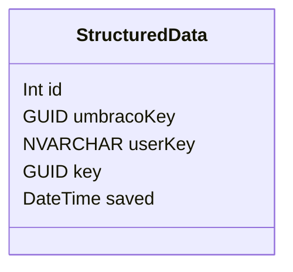

## Resources:

- [Rich Results Test](https://search.google.com/test/rich-results)
- [The Google Search Gallery](https://developers.google.com/search/docs/appearance/structured-data/search-gallery)

## Features:

1. Article
1. Book
1. Breadcrumb
1. Carousel
1. Course
1. Dataset
1. Education Q&A
1. EmployerAggregateRating
1. Estimated salary
1. Event
1. Fact Check
1. FAQ
1. Home Activities
1. How-to
1. Image Metadata
1. JobPosting
1. Learning Video
1. Local Business
1. Logo
1. Math solvers
1. Movie
1. Practice problems
1. Product
1. Q&A Pages
1. Recipe
1. Review snippet
1. Sitelinks Search Box
1. Software App
1. Speakable
1. Subscription and paywalled content
1. Video

## Database

